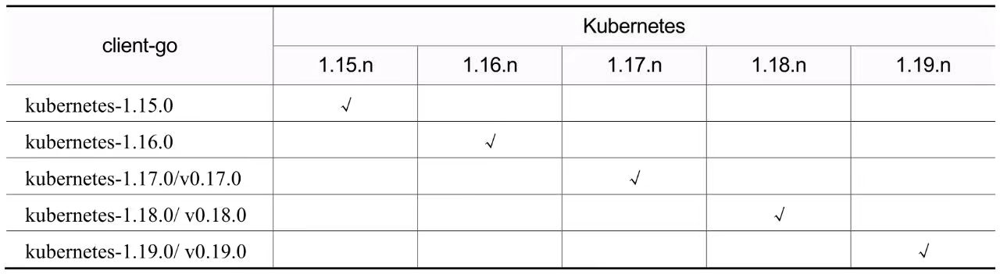

# Kubernetes Client-go

## 一、Client-go 项目介绍

### 1. client-go 项目结构

- client-go的包结构
  + kubernetes：这个包中放的是用client-gen自动生成的用来访问Kubernetes API的ClientSet，后面会经常看到ClientSet这个工具。
  + discovery：这个包提供了一种机制用来发现API Server支持的API资源。
  + dynamic：这个包中包含dynamic client，用来执行任意API资源对象的通用操作。
  + plugin/pkg/client/auth：这个包提供了可选的用于获取外部源证书的认证插件。
  + transport：这个包用于设置认证和建立连接。
  + tools/cache：这个包中放了很多和开发控制器相关的工具集。

### 2. client-go 版本规则

由于一些历史原因，client-go的版本规则经历了几次变化。不用去关注很早的版本都有哪些规则，简单理解client-go的版本就是一句话：

    Kubernetes版本大于或等于1.17.0时，cllient-go版本使用对应的v0.x.y；
    Kubernetes版本小于1.17.0时，client-go版本使用kubernetes-1.x.y。
    其中，x和y与Kubernetes版本号后两位保持一致，比如Kubernetes v1.17.0对应client-go v0.17.0。

这里说的client-go的版本 体现在tag上，我们在client-go的GitHub代码库的tag列表中可以直观地看到这些[tag](https://github.com/kubernetes/client-go/tags)。下表展示了以Kubernetes 1.17.0版本为中点，client-go和Kubernetes的版本对应关系。



如表所示，第一行是Kubernetes版本，第一列是client-go版本。在Kubernetes 1.17.0版本之后，client-go老的版本号规则为了更好的兼容性还是保留着，不过最好还是使用新版本号v0.x.y这种格式。

另外，client-go代码库的分支规则和tag又稍有区别，下面简单地通过下表看一下Kubernetes 1.15.n版本之后两个代码库的分支规则对应关系。


如表所示，从1.18版本开始，两者的分支名称又对应起来了。其实client-go在Kubernetes 1.5版本以前就是现在的分支命名风格，不过从1.5之后变成了2.0，之后就是3.0、4.0、5.0……这种规则了，直到1.18版本。

### 3. 获取 client-go

在写代码的时候需要使用client-go，第一步肯定是通过go get来获取相应版本的client-go依赖。如果需要新版本，可以直接执行：`go get k8s.io/client-go@latest`;

不过这样并不靠谱，一般需要选择明确的版本，最好是和自己使用的Kubernetes集群版本完全一致。可以通过下面的命令来获取需要的版本：`go get k8s.io/client-go@v0.24.6`。


## 二、Client-go 简单使用

### 1. client-go 操作 deployment

- 初始化 DeploymentInterface类型 实例
```golang
  // 获取 home 路径
	homePath := homedir.HomeDir()
	if homePath == "" {
		log.Fatal("failed to get the home directory")
	}
  // 构建 kubeconfig 绝对路径
	kubeconfig := filepath.Join(homePath, ".kube", "config")

	config, err := clientcmd.BuildConfigFromFlags("", kubeconfig)
	if err != nil {
		log.Fatal(err)
	}

	clientset, err := kubernetes.NewForConfig(config)
	if err != nil {
		log.Fatal(err)
	}

  // 初始化一个DeploymentInterface类型的实例
	dpClient := clientset.AppsV1().Deployments(coreV1.NamespaceDefault)
```

- 实现 createDeployment()函数
```golang
	func createDeployment(dpClient v1.DeploymentInterface) error {
		replicas := int32(2)
		newDp := &appsv1.Deployment{
			ObjectMeta: metav1.ObjectMeta{
				Name: "kube-demoapp",
			},
			Spec: appsv1.DeploymentSpec{
				Replicas: &replicas,
				Selector: &metav1.LabelSelector{
					MatchLabels: map[string]string{
						"app": "kube-demoapp",
					},
				},
				Template: coreV1.PodTemplateSpec{
					ObjectMeta: metav1.ObjectMeta{
						Labels: map[string]string{
							"app": "kube-demoapp",
						},
					},
					Spec: coreV1.PodSpec{
						Containers: []coreV1.Container{
							{
								Name:  "demoapp",
								Image: "ikubernetes/demoapp:v1.0",
								Ports: []coreV1.ContainerPort{
									{
										Name:          "demoapp",
										Protocol:      coreV1.ProtocolTCP,
										ContainerPort: 8080,
									},
								},
							},
						},
					},
				},
			},
		}
		_, err := dpClient.Create(context.TODO(), newDp, metav1.CreateOptions{})

		return err
	}

	// 函数调用
	log.Println("create Deployment")
	if err := createDeployment(dpClient); err != nil {
		log.Fatal(err)
	}
	<-time.Tick(1 * time.Minute)
```

- 实现 updateDeployment()函数
```golang
	func updateDeployment(dpClient v1.DeploymentInterface) error {
		dp, err := dpClient.Get(context.TODO(), "kube-demoapp", metav1.GetOptions{})
		if err != nil {
			return err
		}
		dp.Spec.Template.Spec.Containers[0].Image = "ikubernetes/demoapp:v1.1"

		return retry.RetryOnConflict(
			retry.DefaultBackoff, func() error {
				_, err = dpClient.Update(context.TODO(), dp, metav1.UpdateOptions{})
				return err
			},
		)
	}

	// 函数调用
	log.Println("update Deployment")
	if err := updateDeployment(dpClient); err != nil {
		log.Fatal(err)
	}
	<-time.Tick(1 * time.Minute)
```

- 实现 deleteDeployment()函数
  - 关于PropagationPolicy属性，有3种可选特性
    - DeletePropagationOrphan 不考虑依赖资源
    - DeletePropagationBackground 后台删除依赖资源
    - DeletePropagationForeground 前台删除依赖资源
```golang
	func deleteDeployment(dpClient v1.DeploymentInterface) error {
		deletePolicy := metav1.DeletePropagationForeground

		return dpClient.Delete(
			context.TODO(), "kube-demoapp", metav1.DeleteOptions{
				PropagationPolicy: &deletePolicy,
			},
		)
	}

	// 函数调用
	log.Println("delete Deployment")
	if err := deleteDeployment(dpClient); err != nil {
		log.Fatal(err)
	}
	<-time.Tick(1 * time.Minute)
```

- import
```go
	import (
		appsv1 "k8s.io/api/apps/v1"
		coreV1 "k8s.io/api/core/v1"
		metav1 "k8s.io/apimachinery/pkg/apis/meta/v1"
		"k8s.io/client-go/kubernetes"
		v1 "k8s.io/client-go/kubernetes/typed/apps/v1"
		"k8s.io/client-go/tools/clientcmd"
		"k8s.io/client-go/util/homedir"
		"k8s.io/client-go/util/retry"
	)
```


## 三、Client-go 源码分析

在深度使用Kubernetes时难免会涉及Operator的开发，目前虽然已经有Kubebuilder/Operator SDK、controller-runtime等工具可以较好地屏蔽底层细节，让我们专注于自身的业务逻辑，但是不清楚底层原理会让我们在编码过程中心里没底，比如自定义控制器重启时是否会重新收到所有相关Event，调谐的子资源是Deployment时相关Pod的变更是否会触发调谐逻辑等，很多细节问题会不停地跳出来，让我们对自己的代码没有信心。所以我们只有详细分析过client-go和Operator开发相关的各种组件的原理与源码后，才能对自己开发的自定义控制器行为知根知底，胸有成竹。

### 1. client-go 源码概览

client-go项目 是与 kube-apiserver 通信的 clients 的具体实现，其中包含很多相关工具包，例如 `kubernetes`包 就包含与 Kubernetes API 通信的各种 ClientSet，而 `tools/cache`包 则包含很多强大的编写控制器相关的组件。

所以接下来我们以自定义控制器的底层实现原理为线索，来分析client-go中相关模块的源码实现。

如图所示，我们在编写自定义控制器的过程中大致依赖于如下组件，其中圆形的是自定义控制器中需要编码的部分，其他椭圆和圆角矩形的是client-go提供的一些“工具”。


- client-go的源码入口在Kubernetes项目的 `staging/src/k8s.io/client-go` 中，先整体查看上面涉及的相关模块，然后逐个深入分析其实现。
  + Reflector：Reflector 从apiserver监听（watch）特定类型的资源，拿到变更通知后，将其丢到 DeltaFIFO队列 中。
  + Informer：Informer 从 DeltaFIFO 中弹出（pop）相应对象，然后通过 Indexer 将对象和索引丢到 本地cache中，再触发相应的事件处理函数（Resource Event Handlers）。
  + Indexer：Indexer 主要提供一个对象根据一定条件检索的能力，典型的实现是通过 namespace/name 来构造key，通过 Thread Safe Store 来存储对象。
  + WorkQueue：WorkQueue 一般使用的是延时队列实现，在Resource Event Handlers中会完成将对象的key放入WorkQueue的过程，然后在自己的逻辑代码里从WorkQueue中消费这些key。
  + ClientSet：ClientSet 提供的是资源的CURD能力，与apiserver交互。
  + Resource Event Handlers：一般在 Resource Event Handlers 中添加一些简单的过滤功能，判断哪些对象需要加到WorkQueue中进一步处理，对于需要加到WorkQueue中的对象，就提取其key，然后入队。
  + Worker：Worker指的是我们自己的业务代码处理过程，在这里可以直接收到WorkQueue中的任务，可以通过Indexer从本地缓存检索对象，通过ClientSet实现对象的增、删、改、查逻辑。

### 2. client-go 源码概览

WorkQueue一般使用延时队列来实现，在 Resource Event Handlers 中会完成将对象的key放入WorkQueue的过程，然后在自己的逻辑代码里从WorkQueue中消费这些key。

client-go 的 `util/workqueue`包 里主要有三个队列，分别是普通队列、延时队列和限速队列，后一个队列以前一个队列的实现为基础，层层添加新功能，下面按照 Queue、DelayingQueue、RateLimitingQueue 的顺序层层拨开来看各种队列是如何实现的。

- 在 `k8s.io/client-go/util/workqueue` 包下可以看到这样三个Go源文件：
  + queue.go
  + delaying_queue.go
  + rate_limiting_queue.go
  + 这三个文件分别对应三种队列实现，下面逐个对它们进行分析

#### 普通队列 Queue 的实现

**1. 表示Queue的接口和相应的实现结构体**

- 定义Queue的接口在queue.go中直接叫作Interface
```golang
	type Interface interface {
		Add(item interface{})                     // 添加一个元素
		Len() int                                 // 元素个数
		Get() (item interface{}, shutdown bool)   // 获取一个元素，第二个返回值和 channel 类似，标记队列是否关闭了
		Done(item interface{})                    // 标记一个元素已经处理完
		ShutDown()                                // 关闭队列
		ShutDownWithDrain()                       // 关闭队列，但是等待队列中元素处理完
		ShuttingDown() bool                       // 标记当前 channel 是否正在关闭
	}
```

- Interface的实现类型是Type，这个名字延续了用Interface表示interface的风格，里面的三个属性queue、dirty、processing都保存有元素（items），但是含义有所不同
	+ queue：这是一个[ ]t类型，也就是一个切片，因为其有序，所以这里当作一个列表来存储元素的处理顺序。
	+ dirty：属于set类型，dirty就是一个集合，其中存储的是所有需要处理的元素，这些元素也会保存在queue中，但是集合中的元素是无序的，且集合的特性是其里面的元素具有唯一性。
	+ processing：也是一个集合，存放的是当前正在处理的元素，也就是说这个元素来自queue出队的元素，同时这个元素会被从dirty中删除。
```golang
	// Type is a work queue (see the package comment).
	type Type struct {
		// queue defines the order in which we will work on items. Every
		// element of queue should be in the dirty set and not in the
		// processing set.
		queue []t

		// dirty defines all of the items that need to be processed.
		dirty set

		// Things that are currently being processed are in the processing set.
		// These things may be simultaneously in the dirty set. When we finish
		// processing something and remove it from this set, we'll check if
		// it's in the dirty set, and if so, add it to the queue.
		processing set

		cond *sync.Cond

		shuttingDown bool
		drain        bool

		metrics queueMetrics

		unfinishedWorkUpdatePeriod time.Duration
		clock                      clock.WithTicker
	}

	// set类型的定义
	// set类型实现了has()、insert()、delete()、len()几个方法，用于支持集合类型的基本操作
	type empty struct{}
	type t interface{}
	type set map[t]empty

	func (s set) has(item t) bool {
		_, exists := s[item]
		return exists
	}

	func (s set) insert(item t) {
		s[item] = empty{}
	}

	func (s set) delete(item t) {
		delete(s, item)
	}

	func (s set) len() int {
		return len(s)
	}
```

**2.Queue.Add()方法的实现**

- Add()方法用于标记一个新的元素需要被处理
```golang
	// Add marks item as needing processing.
	func (q *Type) Add(item interface{}) {
		q.cond.L.Lock()
		defer q.cond.L.Unlock()
		if q.shuttingDown {                   // 如果queue正在被关闭，则返回
			return
		}
		if q.dirty.has(item) {                // 如果dirty set中已经有了该元素，则返回
			return
		}

		q.metrics.add(item)

		q.dirty.insert(item)                  // 添加到dirty set中
		if q.processing.has(item) {           // 如果正在被处理，则返回
			return
		}

		q.queue = append(q.queue, item)
		q.cond.Signal()                       // 通知getter有新元素到来
	}
```

**3.Queue.Get()方法的实现**

- Get()方法在获取不到元素的时候会阻塞，直到有一个元素可以被返回
```golang
	// Get blocks until it can return an item to be processed. If shutdown = true,
	// the caller should end their goroutine. You must call Done with item when you
	// have finished processing it.
	func (q *Type) Get() (item interface{}, shutdown bool) {
		q.cond.L.Lock()
		defer q.cond.L.Unlock()
		// 如果 q.queue 为空，并且没有正在关闭，则等待下一个元素的到来
		for len(q.queue) == 0 && !q.shuttingDown {
			q.cond.Wait()
		}
		// 这时如果 q.queue 长度还是为0，则说明 q.shuttingDown 为 true，所以直接返回
		if len(q.queue) == 0 { 
			// We must be shutting down.
			return nil, true
		}

		item = q.queue[0]          // 获取 q.queue 第一个元素
		// The underlying array still exists and reference this object, so the object will not be garbage collected.
		q.queue[0] = nil           // 这里的nil赋值是为了让底层数组不再引用该元素对象，从而使这个对象可以被GC
		q.queue = q.queue[1:]      // 更新 q.queue

		q.metrics.get(item)

		// 将刚才获取到的q.queue第一个元素对象，放到 processing 集合中
		q.processing.insert(item)
		q.dirty.delete(item)       // 在 dirty 集合中删除该对象

		return item, false         // 返回元素
	}
```

**4.Queue.Done()方法的实现**

- Done()方法的作用是标记一个元素已经处理完成
```golang
	// Done marks item as done processing, and if it has been marked as dirty again
	// while it was being processed, it will be re-added to the queue for
	// re-processing.
	func (q *Type) Done(item interface{}) {
		q.cond.L.Lock()
		defer q.cond.L.Unlock()

		q.metrics.done(item)

		// 从 processing集合中删除该元素
		q.processing.delete(item)
		// 如果 dirty集合中，还存在该元素，则说明还需要再次处理，重新加入 q.queue中
		if q.dirty.has(item) {
			q.queue = append(q.queue, item)
			q.cond.Signal()                     // 通知getter有新元素
		} else if q.processing.len() == 0 {
			q.cond.Signal()
		}
	}
```

