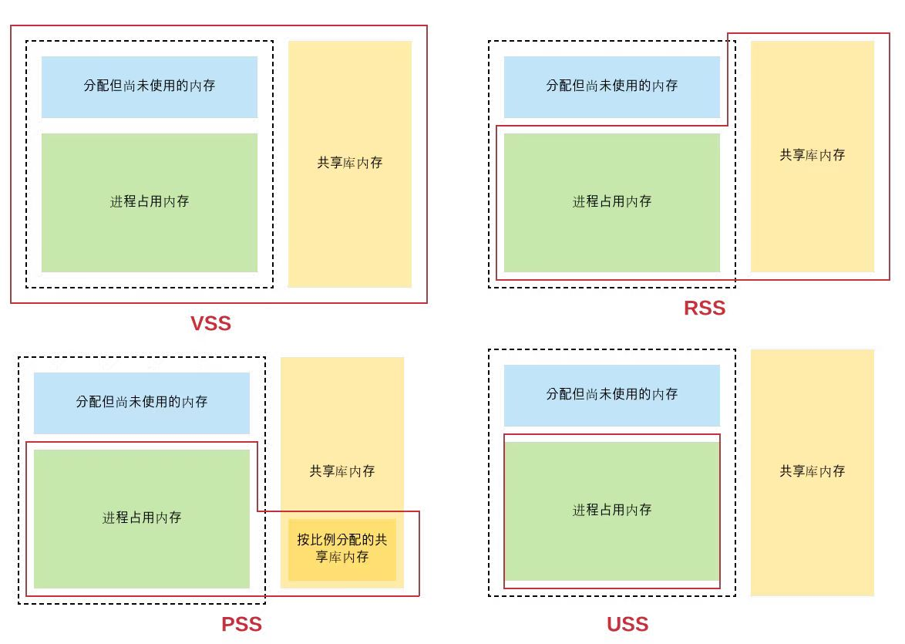
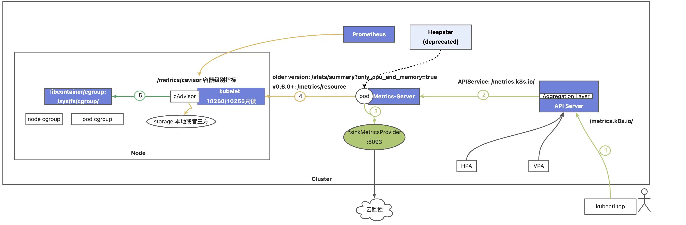
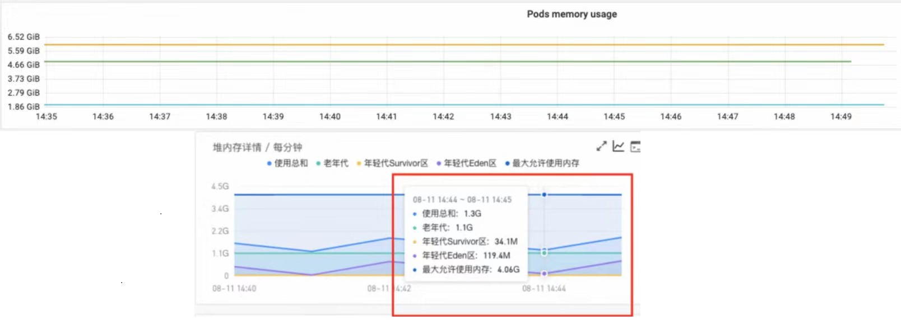
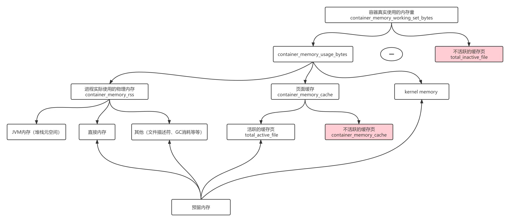
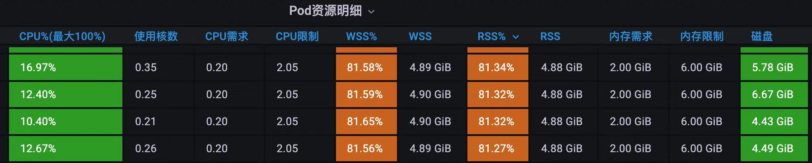

# Linux 内存分析与观测

## 一、Linux 内存的观测

### 1. 系统内存

我们在查看系统内存使⽤状况时，经常会常⽤free命令，具体可见如下输出
```shell
$ free -m
              total        used        free      shared  buff/cache   available
Mem:          14732        1512        4036           4        9183       12888
Swap:             0           0           0
```
可以看到，输出包括两⾏: Mem 和 Swap。

其中Mem表示系统中实际的物理内存;对于Memory来说，我们发现 total = used + free + buff/cache。

Swap表示交换分区(类似windows中的虚拟内存)，是硬盘中⼀个独⽴的分区，⽤于在系统内存不够时，临时存储被释放的内存空间中的内容;对于Swap来说，三者的关系很简单，就是total = used + free。(在上⾯的例⼦中，由于这台ECS禁⽤swap空间，所以swap的值都是0。) 

而前三列 "total"、"used"、"free" 分别表示 总量，使⽤量和有多少空闲空间。
其中 buff 和 cache 分别表示存放了将要写到磁盘中的数据和从磁盘的读取的数据的内存。也就是说内存除了存储进程运⾏所需的运⾏时数据之外，还为了提⾼性能，缓存了⼀部分I/O数据。由于系统的cache和buffer可以被回收，所以可⽤的(available)内存⽐空闲的(free)要⼤。在部署了某些⾼I/O应⽤的主机中，available会⽐free看起来⼤很多，这是由于⼤量的内存空间⽤于缓存对磁盘的I/O数据。

- free命令的所有输出值都是从 `/proc/meminfo` 中读出的
  - [Linux: /proc/meminfo参数详细解释](https://blog.csdn.net/whbing1471/article/details/105468139/)
```shell
$ cat /proc/meminfo
MemTotal:       15085684 kB
MemFree:         4131860 kB
MemAvailable:   13196572 kB
Buffers:          299936 kB
Cached:          8714640 kB
SwapCached:            0 kB
Active:          3811476 kB
Inactive:        6539320 kB
Active(anon):       4224 kB
Inactive(anon):  1334548 kB
Active(file):    3807252 kB
Inactive(file):  5204772 kB
Unevictable:           0 kB
Mlocked:               0 kB
SwapTotal:             0 kB
SwapFree:              0 kB
Dirty:              1432 kB
Writeback:             0 kB
AnonPages:       1196364 kB
Mapped:           715388 kB
Shmem:              5080 kB
Slab:             450368 kB
SReclaimable:     389484 kB
SUnreclaim:        60884 kB
KernelStack:       11728 kB
PageTables:        13644 kB
NFS_Unstable:          0 kB
Bounce:                0 kB
WritebackTmp:          0 kB
CommitLimit:     7542840 kB
Committed_AS:    5119088 kB
VmallocTotal:   34359738367 kB
VmallocUsed:           0 kB
VmallocChunk:          0 kB
Percpu:             4624 kB
HardwareCorrupted:     0 kB
AnonHugePages:    641024 kB
ShmemHugePages:        0 kB
ShmemPmdMapped:        0 kB
FileHugePages:         0 kB
FilePmdMapped:         0 kB
CmaTotal:              0 kB
CmaFree:               0 kB
HugePages_Total:       0
HugePages_Free:        0
HugePages_Rsvd:        0
HugePages_Surp:        0
Hugepagesize:       2048 kB
Hugetlb:               0 kB
DirectMap4k:      268088 kB
DirectMap2M:    10217472 kB
DirectMap1G:     7340032 kB
```

- 相关命令
```shell
# top类的命令查看进程/线程、CPU、内存使用情况，CPU使用情况
$ top/htop/atop

# 实时内存
$ sar -r
$ sar -R

# 查看内存使用情况，内存、CPU、IO状态
$ vmstat 2
```

### 2. 进程内存

通过free命令，我们可以看到系统总体的内存使⽤状况。但很多时需要查看特定进程(process)所消耗的内存，这时我们最常⽤的命令是 `ps`，这个命令的输出中有两列与内存相关，分别是VSZ和RSS。此外还有另外两个类似的指标——PSS和USS，这⾥将这四个⼀并讨论: 

|指标缩写|全称|含义|
|:------:|:------:|:------:|
|VSZ(VSS)|Virtual Memory Size(Virtual Set Size)|虚拟内存⼤⼩，代表进程可访问的全部虚拟内存大小，包括实际物理内存、共享库和Swap。它反映了进程地址空间的最大值。VSZ对于判断一个进程实际占用的内存并没有什么帮助。|
|RSS|Resident Set Size|常驻内存集合⼤⼩，代表进程当前实际使用的物理内存大小，即相应进程在RAM中占⽤了多少内存，并不包含在Swap中占⽤的虚拟内存。包括进程所使⽤的共享库所占⽤的全部内存，即使某个共享库只在内存中加载了⼀次，所有使⽤了它的进程的RSS都会分别把它计算在内。(把所有进程的RSS加到⼀起，通常会⽐实际使⽤的内存⼤，因为⼀些共享库所⽤的内存重复计算了多次。)|
|PSS|Proportional Set Size|比例集大小，与RSS类似，唯⼀的区别是在计算共享库内存是是按⽐例分配。⽐如某个共享库占用了3M内存，同时被3个进程共享，那么在计算这3个进程的PSS时，该共享库这会贡献1兆内存。PSS通过考虑共享内存的比例，对共享内存进行分配，从而更准确地反映了进程占用的实际物理内存。|
|USS|Unique Set Size|唯一集大小，代表进程独占的物理内存大小，不包含Swap和共享库。也就是说，如果有多个进程共享同一块内存，这部分内存只会计入一个进程的USS。|



以上这些指标可以通过`/proc/[pid]/smaps`文件中找到，其中pid是进程的ID。这四者的⼤⼩关系是: VSS >= RSS >= PSS >= USS

分析进程内存的整体使⽤情况，可以从 `/proc/[pid]/status` 文件中读取信息，显示的内容包括进程的VSS和RSS，下面是相关字段的含义: 
```shell
# 系统中 kubelet进程为例
$ cat /proc/377598/status
Name:	kubelet            # 进程的名称
Umask:	0022             # 进程的文件创建掩码
State:	S (sleeping)     # 进程的状态，如运行(R)、睡眠(S)、僵尸(Z)等
Tgid:	377598             # 线程组ID，用于标识线程组
Ngid:	0                  # NUMA组ID，用于非一致内存访问(NUMA)系统的进程间通信
Pid:	377598             # 进程的ID
PPid:	1                  # 父进程的ID
TracerPid:	0            # 如果进程正在被调试，此字段表示调试进程的ID
Uid:	0	0	0	0            # 进程的实际用户ID(Ruid)、有效用户ID(Euid)、保存的设置用户ID(Suid)和文件系统用户ID(Fsuid)
Gid:	0	0	0	0            # 进程的实际组ID(Rgid)、有效组ID(Egid)、保存的设置组ID(Sgid)和文件系统组ID(Fsgid)
FDSize:	256              # 进程打开文件描述符的数量
Groups:                  # 进程所属的组ID列表
NStgid:	377598
NSpid:	377598
NSpgid:	377598
NSsid:	377598
VmPeak:	 1601700 kB      # 进程使用的虚拟内存的峰值
VmSize:	 1548904 kB      # 进程使用的虚拟内存的大小
VmLck:	       0 kB      # 进程锁定的内存大小
VmPin:	       0 kB      # 进程固定的内存大小
VmHWM:	  148400 kB      # 进程使用的最高物理内存的大小
VmRSS:	  145188 kB      # 进程使用的当前物理内存的大小
RssAnon:	   74756 kB    # 进程使用的匿名内存的大小
RssFile:	   70432 kB    # 进程使用的文件缓存的大小
RssShmem:	       0 kB    # 进程使用的共享内存的大小
VmData:	  262180 kB      # 进程使用的数据段的大小
VmStk:	     132 kB      # 进程使用的栈的大小
VmExe:	   55220 kB      # 进程使用的可执行文件的大小
VmLib:	       0 kB      # 进程使用的共享库的大小，即 加载的动态库所占⽤的内存⼤⼩
VmPTE:	     612 kB      # 进程使用的页表项的大小
VmSwap:	       0 kB      # 进程使用的交换空间的大小
HugetlbPages:	       0 kB
CoreDumping:	0
THP_enabled:	1
Threads:	20
SigQ:	0/58832
SigPnd:	0000000000000000
ShdPnd:	0000000000000000
SigBlk:	fffffffc3bba3a00
SigIgn:	0000000000000000
SigCgt:	fffffffdffc1feff
CapInh:	0000000000000000
CapPrm:	0000003fffffffff
CapEff:	0000003fffffffff
CapBnd:	0000003fffffffff
CapAmb:	0000000000000000
NoNewPrivs:	0
Seccomp:	0
Speculation_Store_Bypass:	vulnerable
Cpus_allowed:	f
Cpus_allowed_list:	0-3
Mems_allowed:	00000000,00000000,00000000,00000000,00000000,00000000,00000000,00000000,00000000,00000000,00000000,00000000,00000000,00000000,00000000,00000000,00000000,00000000,00000000,00000000,00000000,00000000,00000000,00000000,00000000,00000000,00000000,00000000,00000000,00000000,00000000,00000001
Mems_allowed_list:	0
voluntary_ctxt_switches:	137
nonvoluntary_ctxt_switches:	33
```

- 相关命令
```shell
# 使用ps命令，直接查看 vsz、rss
$ ps -eo pid,comm,cpu,vsz,rss

# 统计前20内存占用
$ ps -eo pid,comm,rss | awk '{m=$3/1e6;s["*"]+=m;s[$2]+=m} END{for (n in s) printf"%10.3f GB %s\n",s[n],n}' | sort -nr | head -20

# 进程内存统计
$ process_name="${process_name}"
$ for i in $(ps -ef | grep ${process_name} | grep -v grep |awk '{print $2}'); do VmRSS=$(cat /proc/$i/status 2>/dev/null | grep VmRSS); [[ ! -z ${VmRSS} ]] && echo "PID: $i    ${VmRSS}"; done | sort -k4,4nr

# 查看进程排序后内存映射情况
$ pmap -x $pid | sort -n -k3 
# 进程内存地址分析
$ gdb --pid=$pid
$ (gdb) dump memory /tmp/xxx.dump 起始地址 结束地址
$ strings /tmp/xxx.dump | less
```

### 3. 容器内存

#### 容易陷入误区的容器内存观察

接下来，我们查看⼀下容器中的内存使⽤状况。容器由 系统内核所具有 Namespace 与 Cgroup 机制一起，达成了一种进程级的虚拟化机制，实现了各个进程间的资源隔离。

所以，最开始第一个的想法就是进⼊⼀个容器内部，执⾏free命令
```shell
# 但是通过 free 命令可以看到，输出的结果就是系统内存
root@mysql-0:/# free -m
             total       used       free     shared    buffers     cached
Mem:          14732        1512        4036           4        9183       12888
Swap:             0           0           0

# 容器中的 /proc/meminfo 文件也是系统的内存信息
root@mysql-0:/# cat /proc/meminfo
MemTotal:       15085684 kB
MemFree:         4134764 kB
MemAvailable:   13199476 kB
Buffers:          299936 kB
Cached:          8714640 kB
SwapCached:            0 kB
Active:          3811476 kB
Inactive:        6535224 kB
Active(anon):       4224 kB
Inactive(anon):  1330452 kB
Active(file):    3807252 kB
Inactive(file):  5204772 kB
Unevictable:           0 kB
Mlocked:               0 kB
SwapTotal:             0 kB
SwapFree:              0 kB
Dirty:              1416 kB
Writeback:             0 kB
AnonPages:       1192308 kB
Mapped:           715388 kB
Shmem:              5080 kB
Slab:             450368 kB
SReclaimable:     389484 kB
SUnreclaim:        60884 kB
KernelStack:       11728 kB
PageTables:        13644 kB
NFS_Unstable:          0 kB
Bounce:                0 kB
WritebackTmp:          0 kB
CommitLimit:     7542840 kB
Committed_AS:    5110472 kB
VmallocTotal:   34359738367 kB
VmallocUsed:           0 kB
VmallocChunk:          0 kB
Percpu:             4624 kB
HardwareCorrupted:     0 kB
AnonHugePages:    641024 kB
ShmemHugePages:        0 kB
ShmemPmdMapped:        0 kB
FileHugePages:         0 kB
FilePmdMapped:         0 kB
CmaTotal:              0 kB
CmaFree:               0 kB
HugePages_Total:       0
HugePages_Free:        0
HugePages_Rsvd:        0
HugePages_Surp:        0
Hugepagesize:       2048 kB
Hugetlb:               0 kB
DirectMap4k:      268088 kB
DirectMap2M:    10217472 kB
DirectMap1G:     7340032 kB
```

继续查看容器中的主进程(PID = 1)的/proc/1/status，显示的内容包括进程的VSS和RSS，这个数值就是容器中的进程信息
```shell
root@mysql-0:/proc/1# cat /proc/1/status
Name:	mysqld
Umask:	0026
State:	S (sleeping)
Tgid:	1
Ngid:	0
Pid:	1
PPid:	0
TracerPid:	0
Uid:	999	999	999	999
Gid:	999	999	999	999
FDSize:	256
Groups:
NStgid:	1
NSpid:	1
NSpgid:	1
NSsid:	1
VmPeak:	 1360460 kB
VmSize:	 1360460 kB
VmLck:	       0 kB
VmPin:	       0 kB
VmHWM:	  211524 kB
VmRSS:	  211524 kB
RssAnon:	  191616 kB
RssFile:	   19908 kB
RssShmem:	       0 kB
VmData:	  561296 kB
VmStk:	     132 kB
VmExe:	   22460 kB
VmLib:	    9076 kB
VmPTE:	     720 kB
VmSwap:	       0 kB
HugetlbPages:	       0 kB
CoreDumping:	0
THP_enabled:	1
Threads:	30
SigQ:	0/58832
SigPnd:	0000000000000000
ShdPnd:	0000000000000000
SigBlk:	0000000000084007
SigIgn:	0000000000003000
SigCgt:	00000001800006e8
CapInh:	0000000000000000
CapPrm:	0000000000000000
CapEff:	0000000000000000
CapBnd:	00000000a80425fb
CapAmb:	0000000000000000
NoNewPrivs:	0
Seccomp:	0
Speculation_Store_Bypass:	vulnerable
Cpus_allowed:	f
Cpus_allowed_list:	0-3
Mems_allowed:	00000000,00000000,00000000,00000000,00000000,00000000,00000000,00000000,00000000,00000000,00000000,00000000,00000000,00000000,00000000,00000000,00000000,00000000,00000000,00000000,00000000,00000000,00000000,00000000,00000000,00000000,00000000,00000000,00000000,00000000,00000000,00000001
Mems_allowed_list:	0
voluntary_ctxt_switches:	1552
nonvoluntary_ctxt_switches:	9
```

#### 通过cgroup观察容器内存

在遵循one docker one process的原⽣容器中，主进程基本反应了容器的内存使⽤状况，但这毕竟不完整，在目前的环境下⼀个容器中运⾏多个进程的情况也是很常见的。所以，下面我们采用一种更优雅的容器内存查看⽅式，即 Cgroups。

前面也提到过，Cgroups 是组成容器的基石，它被用来制造容器的边界，是约束容器资源的主要手段。​Linux Cgroups 的全称是 Linux Control Group ，是 Linux 内核中用来为进程设置资源限制的一个重要功能。它最主要的作用，就是限制一个进程 组能够使用的资源上限，包括 CPU、内存、磁盘、网络带宽等等。此外，还能够对进程进行优先级设置，以及将进程挂起和恢复等操作。

Cgroups 中的相关概念
  - 任务(task): 在cgroup中，使⽤ task 来表示系统的⼀个进程或线程。
  - 控制组(control group): Cgroups 中的资源控制以 Cgroup 为单位实现。Cgroup 表示按某种资源控制标准划分⽽成的任务组，包含⼀个或多个⼦系统。⼀个任务可以加⼊某个 cgroup，也可以从某个 cgroup 迁移到另⼀个 cgroup。
  - 层级(hierarchy): hierarchy由⼀系列cgroup以⼀个树状结构排列⽽成，每个hierarchy通过绑定对应的subsystem进⾏资源调度。hierarchy中的cgroup节点可以包含零或多个⼦节点，⼦节点继承⽗节点的属性(资源配额、限制等)。整个系统可以有多个hierarchy。
  - ⼦系统(subsystem): Cgroups中的subsystem就是⼀个资源调度控制器(Resource Controller)，⽐如CPU⼦系统可以控制CPU时间分配、memory⼦系统可以控制进程内存的使⽤。⼦系统需要加⼊到某个层级，然后该层级的所有控制组，均受到这个⼦系统的控制。、

Cgroups 包含的 subsystem:

    blkio，用于限制和监控进程组对块设备I/O的使用，包括磁盘读写和I/O调度;
    cpu，用于限制和监控进程组对CPU的使用，可以设置CPU的时间片、使用率等限制;
    cpuacct，统计CPU的使用情况，产生 cgroup 任务的 cpu 资源报告;
    cpuset，用于将进程组绑定到特定的CPU和内存节点上，以实现对CPU和内存资源的分配;
    devices，用于限制和监控进程组对设备的访问，可以控制进程组对特定设备的访问权限;
    freezer，用于暂停和恢复进程组的运行状态，可以用于冻结和恢复进程组的运行;
    hugetlb，限制HugeTLB的使用;
    memory，用于限制和监控进程组对内存的使用，可以设置进程组的内存限制、内存重分配等;
    net_cls，标记cgroups中进程的网络数据包，配合tc(traffic controller)限制网络带宽;
    net_prio，设置进程的网络流量优先级;
    ns，命名空间子系统;
    perf_event，增加了对每 group 的监测跟踪的能力，可以检测属于某个特定的group的所有线程以及运行在特定CPU上的线程。

```shell
# 查看Linux系统中 /sys/fs/cgroup 目录
➜ ls -l /sys/fs/cgroup/
total 0
dr-xr-xr-x 4 root root  0 Feb 29 12:51 blkio
lrwxrwxrwx 1 root root 11 Feb 29 12:51 cpu -> cpu,cpuacct
lrwxrwxrwx 1 root root 11 Feb 29 12:51 cpuacct -> cpu,cpuacct
dr-xr-xr-x 9 root root  0 Feb 29 12:51 cpu,cpuacct
dr-xr-xr-x 3 root root  0 Feb 29 12:51 cpuset
dr-xr-xr-x 3 root root  0 Feb 29 12:51 devices
dr-xr-xr-x 3 root root  0 Feb 29 12:51 freezer
dr-xr-xr-x 3 root root  0 Feb 29 12:51 hugetlb
dr-xr-xr-x 2 root root  0 Feb 29 12:51 ioasids
dr-xr-xr-x 6 root root  0 Feb 29 12:51 memory
lrwxrwxrwx 1 root root 16 Feb 29 12:51 net_cls -> net_cls,net_prio
dr-xr-xr-x 3 root root  0 Feb 29 12:51 net_cls,net_prio
lrwxrwxrwx 1 root root 16 Feb 29 12:51 net_prio -> net_cls,net_prio
dr-xr-xr-x 3 root root  0 Feb 29 12:51 perf_event
dr-xr-xr-x 5 root root  0 Feb 29 12:51 pids
dr-xr-xr-x 3 root root  0 Feb 29 12:51 rdma
dr-xr-xr-x 6 root root  0 Feb 29 12:51 systemd

# 查看Linux系统中，各subsystem下hierarchy和cgroups的数量
➜ cat /proc/cgroups
#subsys_name    hierarchy       num_cgroups     enabled
cpuset  13      114     1
cpu     8       201     1
cpuacct 8       201     1
blkio   10      196     1
memory  7       266     1
devices 4       113     1
freezer 6       114     1
net_cls 2       114     1
perf_event      11      114     1
net_prio        2       114     1
hugetlb 3       114     1
pids    9       206     1
ioasids 5       1       1
rdma    12      114     1
```

以本文的主题，容器内存为例，⼀个容器的某类资源对应系统中⼀个cgroup⼦系统(subsystem)hierachy中的节点。 我们可以在系统 `/sys/fs/cgroup/memory/kubepods.slice/` 目录，找到对应pod以及pod下容器的cgroup的子目录和文件。在这个⽬录中有很多⽂件，都提供了容器对系统资源使⽤状况的信息。

```shell
# 找到 Pod 的uid
➜ kubectl -n kube-system get pod nginx-ingress-controller-75c587dfd5-vwmpz -o jsonpath='{.metadata.uid}'
a659965c-c065-4d39-8b72-3da69b9b7206%

# 找到 Pod 的容器id
➜ kubectl -n kube-system get pod nginx-ingress-controller-75c587dfd5-vwmpz -o jsonpath='{.status.containerStatuses[0].containerID}'
containerd://2dbf8429915e5bd5cd35951ab61438b0ad1213d058a3491799184d76f2481037%

# 在Pod宿主机找到其对应容器的cgroup目录
➜ ls /sys/fs/cgroup/memory/kubepods.slice/kubepods-burstable.slice/kubepods-burstable-poda659965c_c065_4d39_8b72_3da69b9b7206.slice/cri-containerd-2dbf8429915e5bd5cd35951ab61438b0ad1213d058a3491799184d76f2481037.scope/
cgroup.clone_children                 memory.direct_swapout_global_latency  memory.kmem.max_usage_in_bytes      memory.memsw.limit_in_bytes      memory.pgtable_bind              memory.thp_control        memory.wmark_ratio
cgroup.event_control                  memory.direct_swapout_memcg_latency   memory.kmem.slabinfo                memory.memsw.max_usage_in_bytes  memory.pgtable_misplaced         memory.thp_reclaim        memory.wmark_scale_factor
cgroup.procs                          memory.duptext_nodes                  memory.kmem.tcp.failcnt             memory.memsw.usage_in_bytes      memory.pressure_level            memory.thp_reclaim_ctrl   notify_on_release
memory.allow_duptext                  memory.exstat                         memory.kmem.tcp.limit_in_bytes      memory.min                       memory.priority                  memory.thp_reclaim_stat   pool_size
memory.allow_duptext_refresh          memory.failcnt                        memory.kmem.tcp.max_usage_in_bytes  memory.move_charge_at_immigrate  memory.reap_background           memory.usage_in_bytes     tasks
memory.allow_text_unevictable         memory.force_empty                    memory.kmem.tcp.usage_in_bytes      memory.numa_stat                 memory.soft_limit_in_bytes       memory.use_hierarchy
memory.async_fork                     memory.high                           memory.kmem.usage_in_bytes          memory.oom_control               memory.stat                      memory.use_priority_oom
memory.direct_compact_latency         memory.idle_page_stats                memory.limit_in_bytes               memory.oom.group                 memory.swap.events               memory.use_priority_swap
memory.direct_reclaim_global_latency  memory.idle_page_stats.local          memory.low                          memory.pagecache_limit.enable    memory.swap.high                 memory.wmark_high
memory.direct_reclaim_memcg_latency   memory.kmem.failcnt                   memory.max_usage_in_bytes           memory.pagecache_limit.size      memory.swappiness                memory.wmark_low
memory.direct_swapin_latency          memory.kmem.limit_in_bytes            memory.memsw.failcnt                memory.pagecache_limit.sync      memory.text_unevictable_percent  memory.wmark_min_adj
```

关于`/sys/fs/cgroup/memory/` 目录，下面列举了部分文件的作用
  - memory.usage_in_bytes 已使用的内存总量(包含cache和buffer)(字节)，相当于Linux的used_meme
  - memory.limit_in_bytes 限制的内存总量(字节)，相当于linux的total_mem
  - memory.failcnt 申请内存失败(被限制)次数计数
  - memory.max_usage_in_bytes 查看内存最⼤使⽤量
  - memory.memsw.usage_in_bytes 已使用的内存总量和swap(字节)
  - memory.memsw.limit_in_bytes 限制的内存总量和swap(字节)
  - memory.memsw.failcnt 申请内存和swap失败次数计数
  - memory.use_hierarchy 设置或查看层级统计的功能
  - memory.oom_control 设置or查看内存超限控制信息(OOM killer)
  - memory.stat 内存统计信息

而在容器内部，可以直接查看对应容器的`/sys/fs/cgroup/memory/`目录，也是一样的效果，可以查看容器的内存状况:
```shell
➜ kubectl -n kube-system exec -it  nginx-ingress-controller-75c587dfd5-vwmpz -c nginx-ingress-controller sh
kubectl exec [POD] [COMMAND] is DEPRECATED and will be removed in a future version. Use kubectl exec [POD] -- [COMMAND] instead.

/etc/nginx $ cat /sys/fs/cgroup/memory/memory.stat
cache 11218944                            # 页缓存，包括 tmpfs(shmem)，单位为字节
rss 94752768                              # 匿名和 swap 缓存，不包括 tmpfs(shmem)，单位为字节
rss_huge 71303168
shmem 11083776
mapped_file 29884416                      # 映射的文件大小，包括 tmpfs(shmem)，单位为字节
dirty 0
writeback 0
swap 0                                    # swap用量，单位为字节
pgpgin 2653728                            # 存入内存中的页数
pgpgout 2646707                           # 从内存中读取的页数
pgfault 2671812
pgmajfault 0
inactive_anon 107532288                   # 不活跃的 LRU 列表中的中的匿名和 swap 缓存，包括 tmpfs(shmem)，单位为字节
active_anon 540672                        # 在活跃的最近最少使用(LRU)列表中的匿名和 swap 缓存，包括 tmpfs(shmem)，单位为字节;匿名内存，指没有关联到文件的内存，例如进程的堆、栈、数据段等
inactive_file 20480                       # 不活跃的 LRU 列表中的 file-backed 内存，单位为字节
active_file 18919424                      # 在活跃的 LRU 列表中的 file-backed 内存，单位为字节。程序读写文件会产生文件缓存(file cache)，其中最近多次使用的缓存称为active file cache，通常不容易被系统回收。
unevictable 0                             # 无法再生的内存，单位为字节
hierarchical_memory_limit 6289965056            # 包含 memory cgroup 的层级的内存限制，单位为字节
hierarchical_memsw_limit 9223372036854771712    # 包含 memory cgroup 的层级的内存加 swap 限制，单位为字节
total_cache 11218944
total_rss 94752768
total_rss_huge 71303168
total_shmem 11083776
total_mapped_file 29884416
total_dirty 0
total_writeback 0
total_swap 0
total_pgpgin 2653728
total_pgpgout 2646707
total_pgfault 2671812
total_pgmajfault 0
total_inactive_anon 107532288
total_active_anon 540672
total_inactive_file 20480
total_active_file 18919424
total_unevictable 0

# 条件允许的话，container_memory_usage_bytes指标可以直接从 cgroup 中的 memory.usage_in_bytes文件获取
/etc/nginx $ cat /sys/fs/cgroup/memory/memory.usage_in_bytes
127254528

# container_memory_working_set_bytes = container_memory_usage_bytes - total_inactive_file(不活跃文件页)
#                                    = 127254528 - 20480
#                                    = 127234048/1024/1024
#                                    = 121Mi
```

在Linux内核中，对于进程的内存使⽤与Cgroup的内存使⽤统计有⼀些相同和不同的地⽅
  - 进程的RSS为进程使用的所有物理内存，不包含Swap，包含共享内存;
  - Cgroup RSS 包含 Swap，不包含共享内存;在没有swap的情况下，Cgroup的RSS更像是进程的USS;
  - 两者都不包含⽂件系统的Cache;
  - 在Cgroup中，Cache指的是包括文件系统缓存和共享内存在内的缓存大小;故Cgroup Cache包含⽂件系统的Cache和共享内存。
  
关于这两者，Cgroup的内存统计是针对整个容器中的所有进程而言的，而进程的内存统计针对的是单个或者特定的进程。在遵循one docker one process的容器技术中，主进程基本反应了容器的内存使⽤状况，但这毕竟不完整。在很多场景下，⼀个容器中运⾏多个进程甚至大量线程也是很常见的情况，此时进程的内存统计就是一种很好的补充观测手段了。

就像进程的USS最准确的反映了进程⾃身使⽤的内存，Cgroup 的 RSS 也最真实的反映了容器所占⽤的内存空间。而我们一般查看整体容器的Cgroup 情况，就是查看 `/sys/fs/cgroup/memory/memory.stat` 中的 RSS + Cache 的值

Linux 中 关于cgroup的文档
  - [Linux kernel memory](https://www.kernel.org/doc/Documentation/cgroup-v1/memory.txt)
  - [CGroup的原理和使用](https://blog.csdn.net/m0_72502585/article/details/128013318)
  - [带你了解linux cgroups](https://blog.csdn.net/weixin_47465999/article/details/130454716)

#### 容器内存常用的监控工具以及指标

容器的内存监控⼯具 cAdvisor 就是通过读取 cgroup 信息来获取容器的内存使⽤信息。其中有⼀个监控指标 container_memory_usage_bytes(Current memory usage in bytes, including allmemory regardless of when it was accessed)，如果只看名字和注解，很⾃然就认为它是容器所使⽤的内存。但是这⾥所谓的 usage 和通过free指令输出的 used memory 的含义是不同的，前者实际上是cgroup的 rss、cache的和，⽽后者不包含 cache。


我们常用的命令，`kubectl top`命令就类似于linux 系统中的`top`命令，可以查看集群node节点或pod的cpu、内存的使用量。

使用`kubectl top`命令，依赖于集群中部署的[Metrics-Server服务](https://github.com/kubernetes-sigs/metrics-server)。

在我们执行`kubectl top`命令后，会根据集群中配置的 apiservice 资源`v1beta1.metrics.k8s.io`，由集群的 kube-apiserver 向 Metrics-Server 服务转发调用请求。
```shell
# 查看apiservice 资源 v1beta1.metrics.k8s.io
➜ kubectl get apiservice v1beta1.metrics.k8s.io -oyaml
apiVersion: apiregistration.k8s.io/v1
kind: APIService
metadata:
  name: v1beta1.metrics.k8s.io
spec:
  group: metrics.k8s.io
  groupPriorityMinimum: 100
  insecureSkipTLSVerify: true
  service:
    name: metrics-server        # 转发给service: metrics-server
    namespace: kube-system
    port: 443
  version: v1beta1
  versionPriority: 100
```

具体的api请求路径为 `/apis/metrics.k8s.io/v1beta1/nodes/xxxxx` 和 `/apis/metrics.k8s.io/v1beta1/namespaces/xxxxx/pods/xxxxx`，通过 `kubectl get --raw`命令，可以直接调用该接口。

这里可以看下具体的执行结果，可以看到通过 `kubectl top` 和 `kubectl get --raw` 调用接口，获取到的资源数值都是一样的。
```shell
➜ kubectl -n kube-system top pod nginx-ingress-controller-75c587dfd5-vwmpz
NAME                                        CPU(cores)   MEMORY(bytes)
nginx-ingress-controller-75c587dfd5-vwmpz   4m           121Mi

# 通过 jq 管道处理以便于阅读
➜ kubectl get --raw /apis/metrics.k8s.io/v1beta1/namespaces/kube-system/pods/nginx-ingress-controller-75c587dfd5-vwmpz | jq '.'
{
  "kind": "PodMetrics",
  "apiVersion": "metrics.k8s.io/v1beta1",
  "metadata": {
    "name": "nginx-ingress-controller-75c587dfd5-vwmpz",
    "namespace": "kube-system",
    "selfLink": "/apis/metrics.k8s.io/v1beta1/namespaces/kube-system/pods/nginx-ingress-controller-75c587dfd5-vwmpz",
    "creationTimestamp": "2024-03-17T11:06:33Z"
  },
  "timestamp": "2024-03-17T11:06:03Z",
  "window": "30s",
  "containers": [
    {
      "name": "nginx-ingress-controller",
      "usage": {
        "cpu": "3481509n",
        "memory": "124172Ki"   # 124172Ki/1024=121Mi
      }
    }
  ]
}
```



    需要注意的是 Metrics-Server 并不是 kube-apiserver 的一部分，而是通过 Aggregator 这种插件机制，在独立部署的情况下同 kube-apiserver 一起统一对外服务的。 

    当 Kubernetes 的 API Server 开启了 Aggregator 模式之后，再访问 `/apis/metrics.k8s.io/v1beta1` 的时候，实际上访问到的是一个叫作 kube-aggregator 的代理。而 kube-apiserver，正是这个代理的一个后端， Metrics-Server 则是另一个后端。 

通过上面的接口访问Metrics-Server服务，最后会获取到由 cAdvisor 提供的 cgroup数据，这里对应的内存指标名为 container_memory_working_set_bytes。其代表的含义是容器真实使用的内存量，也是资源限制limit时的重启判断依据，超过limit会导致oom。

关于`kubectl top`命令，本文也就不做更详细的介绍了，有兴趣的大家可以移步[从kubectl top看K8S监控原理](http://www.xuyasong.com/?p=1781#41_kubectl_top)进行翻阅。

上面提到监控指标的计算公式为
  - `container_memory_working_set_bytes = container_memory_usage_bytes - total_inactive_file(不活跃文件页)` container_memory_working_set_bytes 是容器真实使用的内存量，也是资源限制limit时的重启判断依据，超过limit会导致oom
  - `container_memory_usage_bytes = container_memory_rss + container_memory_cache + kernel memory(kernel可以忽略，在容器中 kernel_memory ~= 0)` 需要注意的是，这里公式得出的是一个近似值，可能还受到其他因素的影响，例如内存压缩、内核数据结构的复杂性等。
  - `rss(匿名内存) = total_inactive_anon + total_active_anon`
  - `cache = total_inactive_file + total_active_file`

有时候查看容器本身的内存使用量是一方面，而容器内进程实际资源占用的情况，也需要我们在node宿主机上，看对应进程的资源消耗情况。

container_memory_usage_bytes指标可以直接从 cgroup 中的 memory.usage_in_bytes文件获取，但container_memory_working_set_bytes指标并没有具体的文件，它的计算逻辑在 cadvisor 的代码中，具体如下: 
```golang
  // cadvisor的指标说明
  // https://github.com/google/cadvisor/blob/master/docs/storage/prometheus.md)
  // cAdvisor中描述容器状态的数据结构 ContainerStats
  // https://github.com/google/cadvisor/blob/master/info/v1/container.go#L933
  type ContainerStats struct {
    ...
    Cpu       CpuStats                `json:"cpu,omitempty"`
    DiskIo    DiskIoStats             `json:"diskio,omitempty"`
    Memory    MemoryStats             `json:"memory,omitempty"`
    ...
  }

  // cAdvisor 中容器内存状态的数据结构 MemoryStats
  // https://github.com/google/cadvisor/blob/master/info/v1/container.go#L365
  type MemoryStats struct {
    // Current memory usage, this includes all memory regardless of when it was
    // accessed.
    // Units: Bytes.
    Usage uint64 `json:"usage"`

    ...

    // The amount of working set memory, this includes recently accessed memory,
    // dirty memory, and kernel memory. Working set is <= "usage".
    // Units: Bytes.
    WorkingSet uint64 `json:"working_set"`

    ...
  }

  // cAdvisor 中采集容器指标的函数
  // https://github.com/google/cadvisor/blob/master/metrics/prometheus.go#L109
  func NewPrometheusCollector(i infoProvider, f ContainerLabelsFunc, includedMetrics container.MetricSet, now clock.Clock, opts v2.RequestOptions) *PrometheusCollector {
    ...
    if includedMetrics.Has(container.MemoryUsageMetrics) {
      c.containerMetrics = append(c.containerMetrics, []containerMetric{
        {
          ...
        },{
          name:      "container_memory_usage_bytes",
          help:      "Current memory usage in bytes, including all memory regardless of when it was accessed",
          valueType: prometheus.GaugeValue,
          getValues: func(s *info.ContainerStats) metricValues {
            return metricValues{{value: float64(s.Memory.Usage), timestamp: s.Timestamp}}
          },
        },{
          ...
        },{
          name:      "container_memory_working_set_bytes",
          help:      "Current working set in bytes.",
          valueType: prometheus.GaugeValue,
          getValues: func(s *info.ContainerStats) metricValues {
            return metricValues{{value: float64(s.Memory.WorkingSet), timestamp: s.Timestamp}}
          },
        },
      }...)
    }
  }

  // ContainerStats.Memory.Usage 与 ContainerStats.Memory.workingSet 的计算方式
  // https://github.com/google/cadvisor/blob/master/container/libcontainer/handler.go#L801
  func setMemoryStats(s *cgroups.Stats, ret *info.ContainerStats) {
    ret.Memory.Usage = s.MemoryStats.Usage.Usage  // container_memory_usage_bytes
    ...

    inactiveFileKeyName := "total_inactive_file"
    if cgroups.IsCgroup2UnifiedMode() {
      inactiveFileKeyName = "inactive_file"
    }

    workingSet := ret.Memory.Usage // container_memory_usage_bytes
    if v, ok := s.MemoryStats.Stats[inactiveFileKeyName]; ok {
      if workingSet < v {
        workingSet = 0
      } else {
        workingSet -= v // container_memory_working_set_bytes = container_memory_usage_bytes - total_inactive_file
      }
    }
    ret.Memory.WorkingSet = workingSet
  }
```

## 二、案例分析  

### 1. 低版本内核系统中容器内存 total_active_file 数量级高
- 问题描述
  - 某集群中的Pod，监控显示 Pod内存使用为 5.5G，但是 Pod中服务本身只使用了1.6G

- 重点排查步骤
  - kubernetes 官方文档也说明了 kubelet 将 active_file 内存区域视为不可回收
  - [active_file 内存未被视为可用内存](https://kubernetes.io/zh-cn/docs/concepts/scheduling-eviction/node-pressure-eviction/#active-file-%E5%86%85%E5%AD%98%E6%9C%AA%E8%A2%AB%E8%A7%86%E4%B8%BA%E5%8F%AF%E7%94%A8%E5%86%85%E5%AD%98)
```shell
# 节点系统 centos_7_06_64_20G_alibase_20190619.vhd 3.10.0-957.21.3.el7.x86_64
# /sys/fs/cgroup/memory/kubepods.slice/kubepods-burstable.slice/kubepods-burstable-pod<pod ID>.slice/
$ cat /sys/fs/cgroup/memory/kubepods.slice/kubepods-burstable.slice/kubepods-burstable-pod9c785710_32ec_4baa_a967_3183025768fa.slice/memory.stat
cache 0
rss 0
rss_huge 0
mapped_file 0
swap 0
pgpgin 0
pgpgout 0
pgfault 0
pgmajfault 0
inactive_anon 0
active_anon 0
inactive_file 0
active_file 0
unevictable 0
hierarchical_memory_limit 3221225472
hierarchical_memsw_limit 9223372036854771712
total_cache 1928810496
total_rss 1292386304
total_rss_huge 14680064
total_mapped_file 32768
total_swap 0
total_pgpgin 4825542
total_pgpgout 4042694
total_pgfault 3627216
total_pgmajfault 262
total_inactive_anon 0
total_active_anon 1292386304
total_inactive_file 580984832
total_active_file 1347825664   # 数量级很高
total_unevictable 0

# 集群中每个node节点上容器的total_active_file缓存，占用都有20-30G
$ cat /sys/fs/cgroup/memory/kubepods.slice/kubepods-burstable.slice/kubepods-burstable-pod*.slice/memory.stat |grep total_active_file |awk '{a+=$2}END{print a}'
35410173952

# 高内核版本的系统 ALinux2 4.19.91-27.7.al7.x86_64 内核
$ cat /sys/fs/cgroup/memory/kubepods/burstable/poda3726f29-0381-11ee-a39b-5254001450b7/memory.stat
cache 0
rss 0
rss_huge 0
shmem 0
mapped_file 0
dirty 0
writeback 0
swap 0
pgpgin 0
pgpgout 0
pgfault 0
pgmajfault 0
inactive_anon 0
active_anon 0
inactive_file 0
active_file 0
unevictable 0
hierarchical_memory_limit 4294967296
hierarchical_memsw_limit 9223372036854771712
total_cache 1852940288
total_rss 2250285056
total_rss_huge 0
total_shmem 0
total_mapped_file 401408
total_dirty 520192
total_writeback 0
total_swap 0
total_pgpgin 53762041
total_pgpgout 52760277
total_pgfault 11727726
total_pgmajfault 18
total_inactive_anon 0
total_active_anon 2250285056
total_inactive_file 1812811776
total_active_file 40095744      # 明显下降
total_unevictable 0
```

- 验证测试
  - 清理缓存 `echo 1 > /proc/sys/vm/drop_caches`，有效
  - 升级node节点的系统内核小版本，进行验证，没有效果
```shell
# 升级内核版本
# 1、确定当前内核版本
$ uname -r
3.10.0-514.26.2.el7.x86_64  # 需要升级到 kernel-3.10.0-1160.45.1.el7.x86_64.rpm 版本(用于安装GPU驱动)

# 2、下载指定内核版本
# 下载地址: http://ftp.scientificlinux.org/linux/scientific/7.0/x86_64/updates/security/
$ wget http://ftp.scientificlinux.org/linux/scientific/7.0/x86_64/updates/security/kernel-3.10.0-1160.45.1.el7.x86_64.rpm

# 3、安装内核版本
# 直接使用yum安装下载到本地的内核版本 
$ yum -y install kernel-3.10.0-1160.45.1.el7.x86_64.rpm  # 安装过程中没有报错，表示安装成功

# 4、列出当前系统所有内核版本
$ awk -F\' '$1=="menuentry " {print i++ " : " $2}' $(find /boot -name grub.cfg)

# 5、列出系统引导入口
$ grub2-editenv list

# 6、修改默认引导入口
$ grub2-set-default 0

# 7、重新构建一下grub菜单配置文件
$ grub2-mkconfig -o /boot/grub2/grub.cfg

# 验证 total_active_file 正常 
$ cat memory.stat  |grep total_active_file
total_active_file 61095936                  # 61095936/1024/1024/1024 = 0.056GB
```

- 临时方案
  - 先执行 `sync` ，用于将文件系统的缓冲区数据立即写入磁盘，以确保数据的持久性。
  - 然后再执行下面的命令
    - 清除pagecache `echo 1 > /proc/sys/vm/drop_caches`
    - 回收slab分配器 `echo 2 > /proc/sys/vm/drop_caches`
  - 执行 `sync` 会把内存数据落盘;回收slab分配器会释放页缓存，回收期间会对系统性能产生一些影响，但影响不大

- 最终方案
  - 集群新增使用高内核版本系统的节点
  - 服务迁移，逐渐替换老节点

### 2. java容器内存过大
- 问题描述
  - 某生产集群中的Java Pod，监控显示 Jvm只使用了 1.3G，但是Pod内存监控却有 4.88G



- 信息收集
```shell
$ kubectl -n app-ns get pod app-java-86348df32-rs8ne -oyaml
apiVersion: v1
kind: Pod
metadata:
  name: app-86348df32-rs8ne
  namespace: app-ns
spec:
  containers:
  - env:
    - name: JAVA_OPTS
      value: java -jar -XX:+UseContainerSupport -XX:InitialRAMPercentage=70.0 -XX:MaxRAMPercentage=70.0
        -Dspring.profiles.active=prod -XX:-UseAdaptiveSizePolicy  -XX:NewRatio=2  -XX:SurvivorRatio=8  app.jar
    - name: K8S_ENV
      value: prod
    - name: k8s_logs_console
      value: stdout
    - name: k8s_logs_console_tags
      value: topic=k8s-app_java-console-log
    image: hub/app-java:0.0.2-v9926675b
    imagePullPolicy: Always
    lifecycle:
      preStop:
        exec:
          command:
          - /bin/sh
          - -c
          - echo stop > /tmp/prestop;wget http://127.0.0.1:54199/offline 2>/tmp/null;sleep
            30;exit 0
    livenessProbe:
      failureThreshold: 10
      httpGet:
        path: /app-java/keepalive
        port: http
        scheme: HTTP
      periodSeconds: 10
      successThreshold: 1
      timeoutSeconds: 5
    name: app-java
    ports:
    - containerPort: 11192
      name: http
      protocol: TCP
    readinessProbe:
      failureThreshold: 10
      httpGet:
        path: /app-java/keepalive
        port: http
        scheme: HTTP
      periodSeconds: 10
      successThreshold: 1
      timeoutSeconds: 5
    resources:
      limits:
        cpu: 2048m
        memory: 6Gi
      requests:
        cpu: 200m
        memory: 2Gi
...

$ kubectl -n app-ns top pod  app-java-86348df32-rs8ne
NAME                       CPU(cores)   MEMORY(bytes)   
app-java-86348df32-rs8ne   229m         5006Mi    

# 以下为java容器内的执行结果
$ cat /sys/fs/cgroup/memory/memory.stat
cache 1146900480
rss 5227409408
rss_huge 1799356416
shmem 0
mapped_file 3784704
dirty 0
writeback 0
swap 0
workingset_refault_anon 0
workingset_refault_file 67313664
workingset_activate_anon 0
workingset_activate_file 36360192
workingset_restore_anon 0
workingset_restore_file 0
workingset_nodereclaim 0
pgpgin 11128953
pgpgout 10215508
pgfault 89880285
pgmajfault 66
inactive_anon 5226868736
active_anon 0
inactive_file 1128783872
active_file 18247680
unevictable 0
hierarchical_memory_limit 6442450944
hierarchical_memsw_limit 6442450944
total_cache 1146900480
total_rss 5227409408
total_rss_huge 1799356416
total_shmem 0
total_mapped_file 3784704
total_dirty 0
total_writeback 0
total_swap 0
total_workingset_refault_anon 0
total_workingset_refault_file 67313664
total_workingset_activate_anon 0
total_workingset_activate_file 36360192
total_workingset_restore_anon 0
total_workingset_restore_file 0
total_workingset_nodereclaim 0
total_pgpgin 11128953
total_pgpgout 10215508
total_pgfault 89880285
total_pgmajfault 66
total_inactive_anon 5226868736
total_active_anon 0
total_inactive_file 1128783872
total_active_file 18247680
total_unevictable 0

$ ps -ef
UID          PID    PPID  C STIME TTY          TIME CMD
root           1       0  0 Aug08 ?        00:00:00 /pause
root          64       0  0 Aug08 ?        00:00:00 /bin/sh -c ${JAVA_OPTS}
root          69      64 23 Aug08 ?        19:31:54 java -jar -XX:+UseContainerSupport -XX:InitialRAMPercentage=70.0 -XX:MaxRAMPercentage=70.0 -Dspring.profiles.active=prod -XX:-UseAdaptiveSizePolicy -XX:NewRatio=2
root      145074       0  0 Aug11 pts/0    00:00:00 /bin/sh -c TERM=xterm-256color; export TERM; LANG=C.UTF-8; export LANG; [ -x /bin/bash ] && ([ -x /usr/bin/script ] && /usr/bin/script -q -c "/bin/bash" /dev/null
root      145079  145074  0 Aug11 pts/0    00:00:00 /bin/sh -c TERM=xterm-256color; export TERM; LANG=C.UTF-8; export LANG; [ -x /bin/bash ] && ([ -x /usr/bin/script ] && /usr/bin/script -q -c "/bin/bash" /dev/null
root      145080  145079  0 Aug11 pts/0    00:00:00 /usr/bin/script -q -c /bin/bash /dev/null
root      145081  145080  0 Aug11 pts/1    00:00:00 sh -c /bin/bash
root      145082  145081  0 Aug11 pts/1    00:00:00 /bin/bash
root      145251  145082  0 Aug11 pts/1    00:00:17 top
root      189604       0  0 11:03 pts/2    00:00:00 /bin/sh -c TERM=xterm-256color; export TERM; [ -x /bin/bash ] && ([ -x /usr/bin/script ] && /usr/bin/script -q -c "/bin/bash" /dev/null || exec /bin/bash) || exec
root      189609  189604  0 11:03 pts/2    00:00:00 /bin/sh -c TERM=xterm-256color; export TERM; [ -x /bin/bash ] && ([ -x /usr/bin/script ] && /usr/bin/script -q -c "/bin/bash" /dev/null || exec /bin/bash) || exec
root      189610  189609  0 11:03 pts/2    00:00:00 /usr/bin/script -q -c /bin/bash /dev/null
root      189611  189610  0 11:03 pts/3    00:00:00 sh -c /bin/bash
root      189612  189611  0 11:03 pts/3    00:00:00 /bin/bash
root      189696       0  0 11:05 pts/4    00:00:00 /bin/sh -c TERM=xterm-256color; export TERM; [ -x /bin/bash ] && ([ -x /usr/bin/script ] && /usr/bin/script -q -c "/bin/bash" /dev/null || exec /bin/bash) || exec
root      189701  189696  0 11:05 pts/4    00:00:00 /bin/sh -c TERM=xterm-256color; export TERM; [ -x /bin/bash ] && ([ -x /usr/bin/script ] && /usr/bin/script -q -c "/bin/bash" /dev/null || exec /bin/bash) || exec
root      189702  189701  0 11:05 pts/4    00:00:00 /usr/bin/script -q -c /bin/bash /dev/null
root      189703  189702  0 11:05 pts/5    00:00:00 sh -c /bin/bash
root      189704  189703  0 11:05 pts/5    00:00:00 /bin/bash
root      189831  189704  0 11:08 pts/5    00:00:00 ps -ef

$ cat /proc/69/status
Name:   java
Umask:  0022
State:  S (sleeping)
Tgid:   69
Ngid:   0
Pid:    69
PPid:   64
TracerPid:      0
Uid:    0       0       0       0
Gid:    0       0       0       0
FDSize: 1024
Groups:  
NStgid: 69
NSpid:  69
NSpgid: 64
NSsid:  64
VmPeak: 21901288 kB
VmSize: 21835752 kB
VmLck:         0 kB
VmPin:         0 kB
VmHWM:   5127832 kB
VmRSS:   5120108 kB
RssAnon:         5095276 kB
RssFile:           24832 kB
RssShmem:              0 kB
VmData:  5758564 kB
VmStk:       168 kB
VmExe:         4 kB
VmLib:     17776 kB
VmPTE:     11688 kB
VmSwap:        0 kB
HugetlbPages:          0 kB
CoreDumping:    0
THP_enabled:    1
Threads:        225
SigQ:   0/506295
SigPnd: 0000000000000000
ShdPnd: 0000000000000000
SigBlk: 0000000000000000
SigIgn: 0000000000000000
SigCgt: 2000000191005cdf
CapInh: 00000000a80425fb
CapPrm: 00000000a80425fb
CapEff: 00000000a80425fb
CapBnd: 00000000a80425fb
CapAmb: 0000000000000000
NoNewPrivs:     0
Seccomp:        0
Speculation_Store_Bypass:       vulnerable
Cpus_allowed:   ffffffff
Cpus_allowed_list:      0-31
Mems_allowed:   00000000,00000000,00000000,00000000,00000000,00000000,00000000,00000000,00000000,00000000,00000000,00000000,00000000,00000000,00000000,00000000,00000000,00000000,00000000,00000000,00000000,00000000,00000000,00000000,00000000,00000000,00000000,00000000,00000000,00000000,00000000,00000001
Mems_allowed_list:      0
voluntary_ctxt_switches:        5
nonvoluntary_ctxt_switches:     5
```



- 数据分析
```
从之前收集的信息看: 

1、Java容器内存
container_memory_usage_bytes = container_memory_rss + container_memory_cache + kernel memory(kernel可以忽略)
container_memory_working_set_bytes = container_memory_usage_bytes - total_inactive_file(不活跃文件页)
                                   = container_memory_rss + container_memory_cache + kernel memory(kernel可以忽略) - total_inactive_file
                                   = 5227409408 + 1146900480 - 1128783872
                                   = 5245526061/1024/1024/1024
                                   = 4.885 GB
其中 container_memory_cache - total_inactive_file(不活跃文件页)= 1146900480 - 1128783872
total_inactive_file 本身就包含在cache里面，所以这里的4.88GB中，包含的cache可以忽略不计了

2、Java信息
Jvm堆栈内存为 1.3GB
Java启动参数为
java -jar -XX:+UseContainerSupport -XX:InitialRAMPercentage=70.0 -XX:MaxRAMPercentage=70.0
        -Dspring.profiles.active=prod -XX:-UseAdaptiveSizePolicy  -XX:NewRatio=2  -XX:SurvivorRatio=8  app.jar

3、Java进程信息
pod中 cat /proc/69/status 这个java进程的信息
Name:   java
VmRSS:   5120108 kB/1024 = 5000mB /1024 = 4.88gB

4、服务pod资源限制为
    resources:
      limits:
        cpu: 2048m
        memory: 6Gi
      requests:
        cpu: 200m
        memory: 2Gi
```



- 最终结论
  - 根据计算得出，Java容器内存为 4.885GB，cache可以忽略不计
  - Java容器内java进程，VmRSS 为 4.88gB，说明该java进程的内存使用量基本占用了，Java容器全部的已使用内存
  - 而此时jvm只有1.3GB，需要根据代码分析，其余内存是如何消耗的，是否有泄漏现象

### 3. memory.usage_in_bytes 过大问题
- 问题描述
  - memory.usage_in_bytes 显示内存有 1.95GB 
  - container_memory_working_set_bytes 只有 226.5MB
  - 可以看到差距太大
```shell
[root@hostlocal cri-containerd-86204e4ded8dxxx.scope]# cat memory.usage_in_bytes 
2100830208 # 2090730307/1024/1024 = 1.95GB

# container_memory_working_set_bytes = container_memory_rss + container_memory_cache - total_inactive_file = 235843696 + 2837428 - 1215511 = 226.5MB
[root@hostlocal cri-containerd-86204e4ded8dxxx.scope]# cat memory.stat 
cache 2837428
rss 235843696
rss_huge 123732068
shmem 0
mapped_file 0
dirty 0
writeback 405504
swap 0
pgpgin 13469907
pgpgout 13451379
pgfault 13502709
pgmajfault 0
inactive_anon 2096260072
active_anon 0
inactive_file 1215511
active_file 1892352
unevictable 0
hierarchical_memory_limit 17179869184
hierarchical_memsw_limit 17179869184
total_cache 2837428
total_rss 235843696
total_rss_huge 123732068
total_shmem 0
total_mapped_file 0
total_dirty 0
total_writeback 405504
total_swap 0
total_pgpgin 13469907
total_pgpgout 13451379
total_pgfault 13502709
total_pgmajfault 0
total_inactive_anon 2096260072
total_active_anon 0
total_inactive_file 1215511
total_active_file 1892352
total_unevictable 0
```

- 问题影响
  - 使得 cadvsior 采到的 pod 内存特别高，然后导致 HPA 异常扩容

- 解决方案
  - 参考文档[Alibaba Cloud Linux系统中与透明大页THP相关的性能调优方法](https://help.aliyun.com/zh/ecs/transparent-huge-page-thp-related-performance-optimization-in-alibaba-cloud-linux-2)
  - 通过`echo 0 > /sys/kernel/mm/transparent_hugepage/hugetext_enabled`关闭透明大页
  - 存量内存通过`echo 1 > /sys/kernel/debug/split_huge_pages`释放

- 可能原因：
  - 通过测试复现了，这个情况也和 socket 相关，内存在吃了大量socket链接以后上涨，然后就不会再释放了
  - 此时通过执行`echo 2 > /proc/sys/vm/drop_caches`，也可以清理掉这部分内存
  - 代码中使用`go 1.20 madvise DONOTNEED(MADV_DONTNEED)`
  - 根据现象看把 2MB大页 进行部分MADV_DONTNEED后，就会出现这个问题

- 测试代码，4.19以上内核都能复现
```shell
#include <sys/mman.h>
#include <unistd.h>
#include <stdio.h>

#define HUGE_SIZE (1<<21)
#define PAGE_SIZE (1<<12)

int main() {
    size_t length = 1024*1024*1024; // 2MB 大页
    int i = 0;
    int ret = 0;
    char *p = NULL;

    length -= length%HUGE_SIZE;

    void *addr = mmap(NULL, length+HUGE_SIZE, PROT_READ | PROT_WRITE, MAP_NORESERVE|MAP_PRIVATE | MAP_ANONYMOUS, -1, 0);
    if (addr == MAP_FAILED) {
        perror("mmap");
        return 1;
    }
    addr += HUGE_SIZE - addr%HUGE_SIZE;
    if (madvise(addr, length, MADV_HUGEPAGE) != 0) {
        perror("madvise");
        munmap(addr, length);
        return 1;
    }

    memset(addr, 1, length);
    for(p = addr; p < addr + length; p+= HUGE_SIZE) {
        madvise(p,HUGE_SIZE - PAGE_SIZE,MADV_DONTNEED);
    }
    sleep(100000);
    return 0;
}
```
PS: 其实也是正常现象，usage中额外的内存，会在内存紧张时被回收掉，具体见[kernel 文档](https://lore.kernel.org/linux-mm/1425486792-93161-22-git-send-email-kirill.shutemov@linux.intel.com/)

### 4. java容器进程占用问题

#### 问题描述
- 场景一 
  - 用户容器内的java进程，使用了约 5.3g的内存
  - 但是从Java的应用监控看，堆内存4454M，非堆内存426M 
  - 这两个加起来还差 5.3g-4.8g=0.5g 左右
  - 下图，是通过 `jstat -class {pid}` 拿的数据

- 场景二
  - 场景一的pod，第二天凌晨出现了 fullgc，Java的jvm堆栈监控显示内存下降 2G左右，但是容器中的java进程内存消耗还是约 5.3g
  - 即 Java进程实际使用的物理内存，没有释放。查看内核问题，实际也是这样。

- `jmap`
  - 使用`jmap -heap pid`输出堆内存中的对象信息，包括产生了哪些对象，对象数量多少等。
  - 查看堆内存初始化配置信息以及堆内存的使用情况
  - 使用`jmap -histo[:live] pid`查看堆内存中的对象数目、大小统计直方图，如果带上 live 则只统计活对象

- 排查过程
  - 可以使用 pmap 命令
  - 关于 pmap 命令的介绍，可以参考这个文档 [pmap，linux工具pmap原理？](https://www.cnblogs.com/Chary/p/16719738.html)
  - 下面是基于 `pmap -x 1` 命令，打印的容器 java主进程的内存消耗 
  - 可以看到rss总数是可以对上的，而第一个内存地址 00000006a0000000 有 4502168，即 4.29GB，看起来就是jvm的占用
```shell
➜ pmap -x 1
1:   java -jar -XX:+HeapDumpOnOutOfMemoryError -XX:HeapDumpPath=/home/logs/${HOSTNAME}-dump.log -XX:NewRatio=2 -XX:InitialRAMPercentage=75.0 -XX:MinRAMPercentage=75.0 -XX:MaxRAMPercentage=75.0 -Xss512K -XX:+UseConcMarkSweepGC -Dspring.profiles.active=pro -Darthas.telnetPort=3659 -Darthas.httpPort=8564 -Darthas.agent-id=sch-inventory-start demp-xxxxx.jar
Address           Kbytes     RSS   Dirty Mode  Mapping
00000006a0000000 4750420 4502168 4502168 rw---   [ anon ]
00000007c1f15000 1016748       0       0 -----   [ anon ]
0000561e5793b000       4       4       0 r-x-- java
0000561e57b3b000       4       4       4 r---- java
0000561e57b3c000       4       4       4 rw--- java
0000561e58949000    4156    4136    4136 rw---   [ anon ]
00007fb12b6a2000      12       0       0 -----   [ anon ]
00007fb12b6a5000     504      24      24 rw---   [ anon ]
00007fb12b723000      12       0       0 -----   [ anon ]
00007fb12b726000     504      28      28 rw---   [ anon ]
00007fb12b7a4000      12       0       0 -----   [ anon ]
00007fb12b7a7000     504      28      28 rw---   [ anon ]
00007fb12b825000      12       0       0 -----   [ anon ]
...
00007fb2731bd000       4       4       4 rw--- libpthread-2.31.so
00007fb2731be000      24      12      12 rw---   [ anon ]
00007fb2731c4000       4       4       0 r---- LC_MEASUREMENT
00007fb2731c5000       4       4       0 r---- LC_IDENTIFICATION
00007fb2731c6000       4       4       4 rw---   [ anon ]
00007fb2731c7000       4       4       0 r---- ld-2.31.so
00007fb2731c8000     128     128       0 r-x-- ld-2.31.so
00007fb2731e8000      32      32       0 r---- ld-2.31.so
00007fb2731f0000       4       0       0 r----   [ anon ]
00007fb2731f1000       4       4       4 r---- ld-2.31.so
00007fb2731f2000       4       4       4 rw--- ld-2.31.so
00007fb2731f3000       4       4       4 rw---   [ anon ]
00007fff0ca3d000     144      48      48 rw---   [ stack ]
00007fff0ca66000      12       0       0 r----   [ anon ]
00007fff0ca69000       8       4       0 r-x--   [ anon ]
ffffffffff600000       4       0       0 r-x--   [ anon ]
---------------- ------- ------- -------
total kB         11135288 5517748 5499792%
```

#### 问题结论
- 场景一
  - Java进程除了 Jvm内存(包括堆内存 Heap、堆外内存 Non-Heap)，还有非Jvm内存，包括本地运行库、JNI本地代码
  - 参考文档 [JVM监控内存详情说明](https://help.aliyun.com/zh/arms/application-monitoring/developer-reference/jvm-monitoring-memory-details)

- 场景二
  - Java的jvm堆栈监控看到fullgc后内存降下来，但是Java进程实际上并没有释放，这个是因为jvm申请的堆内存会回收，但是并不会归还给操作系统，从操作系统角度看内存是不会下降的
  - jvm在回收了堆中的内存之后，并不会立刻将这部分内存归还给操作系统
  - 相反，它会保留这些内存以备将来再次使用，这样做可以减少因为频繁地向操作系统申请和释放内存而带来的性能开销

- 业务侧动作
  - 将JVM堆的 limit占比从75%改为60%
  - 从代码层面去减少对象的创建和长时间内存占用，减少长时间执行的代码和长时间的引用

- 其他排查文件
  - [持续剖析功能](https://help.aliyun.com/zh/arms/application-monitoring/user-guide/enable-continuous-profiling)
  - [慢调用链诊断利器-ARMS 代码热点](https://mp.weixin.qq.com/s/_fzVzCX4bts7RByanU_Feg)

#### 关于 Java 应用出现 oom 的排查思路
- 关于oom的情况非常多，问题的确很复杂。而且与使用的框架或者jdk版本可能也有关系(jdk11对比jdk8修复了一些内容，也可能又影响)，没有办法一下子直接定位到根因，可以参考以下思路
  - 保存相关应用日志，找`outofmemory`等关键词
  - 分析系统日志`/var/log/messages`或者`dmesg`观察`outofmemory`的情况、进程运行的记录;
  - 重点关注: 谁触发了oom-killer;最后杀死了谁;当时进程的相关信息。
  - 参考
    - [出现OOM Killer的原因及解决方案](https://help.aliyun.com/zh/alinux/support/causes-of-and-solutions-to-the-issue-of-oom-killer-being-triggered)
    - [解读OOM killer机制输出的日志](https://blog.csdn.net/weixin_39247141/article/details/126304526)

- 定位区域: 
  - 堆内出现问题: 可以打内存快照用ATP分析;或者用MAT工具分析(有一定学习成本，但很有用);
  - 堆外出现问题: 元空间有问题可以查看相关监控;`Direct Memory`有问题，可以用NMT分析;`JNI Memory`有问题，通过排除法最后看这部分;
    - `Direct Memory`: 关键词一般和Netty, 分布式，RPC等有关
    - `JNI Memory`: 这个由于是JVM内存调用了native方法，看不到具体的异常类型，可以用排除法，先看其他几种可能


## 三. 参考文档

- [关于Linux性能调优之内存负载调优](https://blog.51cto.com/liruilong/5930543)
- [Linux中进程内存RSS与cgroup内存的RSS统计 - 差异](https://developer.aliyun.com/article/54407)
- [Linux cache参数调优](https://www.zhihu.com/column/p/136237953)
- [Metrics-Server指标获取链路分析](https://developer.aliyun.com/article/1076518)
- [k8s之容器内存与JVM内存](https://blog.csdn.net/qq_34562093/article/details/126754502)
- [容器内存监控，是看rss还是wss？](https://www.jianshu.com/p/36a1df62cda7)
- [Java进程内存分析](https://www.nxest.com/bits-pieces/java/jvm/)
- [FullGC实战](https://mp.weixin.qq.com/s?__biz=MzU5ODUwNzY1Nw==&mid=2247484533&idx=1&sn=6f6adbccadb3742934dc49901dac76af&chksm=fe426d93c935e4851021c49e5a9eb5a2a9d3c564623e7667e1ef3a8f35cb98717041d0bbccff&scene=0&xtrack=1#rd)
- [JVM调优系列----NewRatio与SurvivorRatio](https://it.cha138.com/php/show-47569.html)
- [pmap，linux工具pmap原理？](https://www.cnblogs.com/Chary/p/16719738.html)
- [JVM监控内存详情说明](https://help.aliyun.com/zh/arms/application-monitoring/developer-reference/jvm-monitoring-memory-details)
- [持续剖析功能](https://help.aliyun.com/zh/arms/application-monitoring/user-guide/enable-continuous-profiling)
- [慢调用链诊断利器-ARMS 代码热点](https://mp.weixin.qq.com/s/_fzVzCX4bts7RByanU_Feg)
- [K8S 容器内 Java 进程内存分析](https://www.xlabs.club/blog/java-memory/)
- [【JVM案例篇】堆外内存(JNI Memory)泄漏(Linux经典64M内存块问题)](https://article.juejin.cn/post/7255634554987020343)
- [找到Linux虚机Load高的"元凶"](https://developer.aliyun.com/article/484253)
- [查看cache的工具 hcache](https://github.com/silenceshell/hcache)
- [一次 Java 进程 OOM 的排查分析（glibc 篇）](https://heapdump.cn/article/1709425)